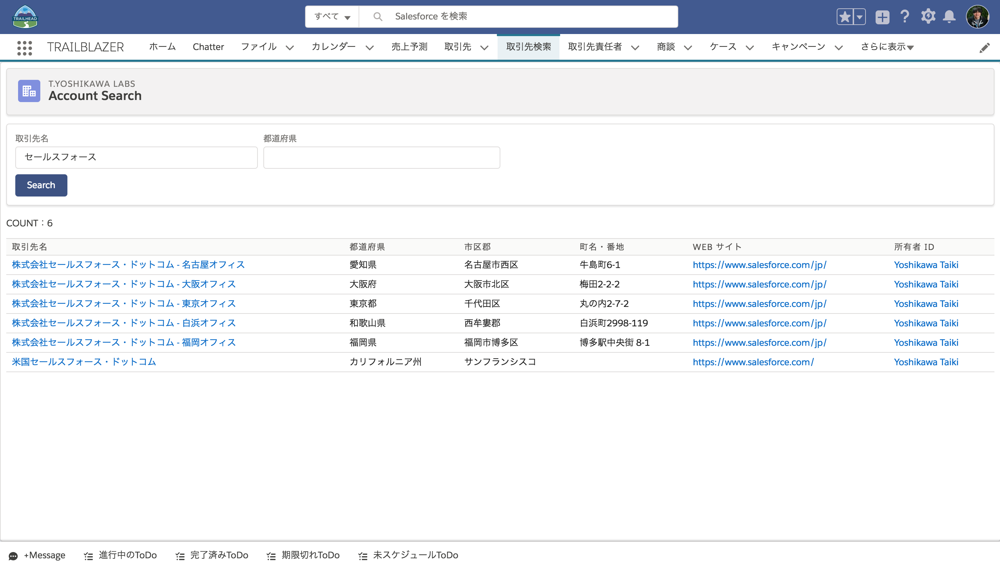
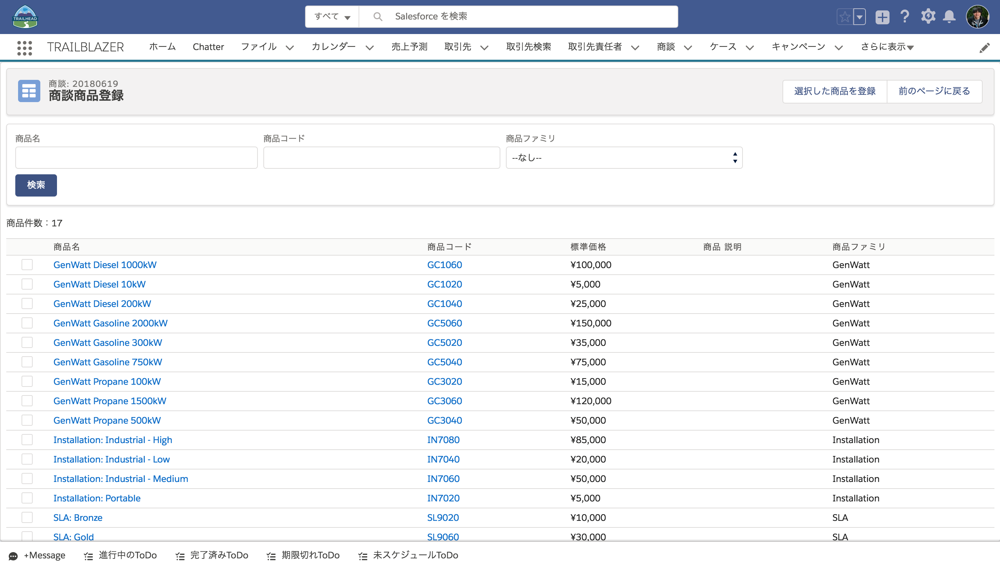
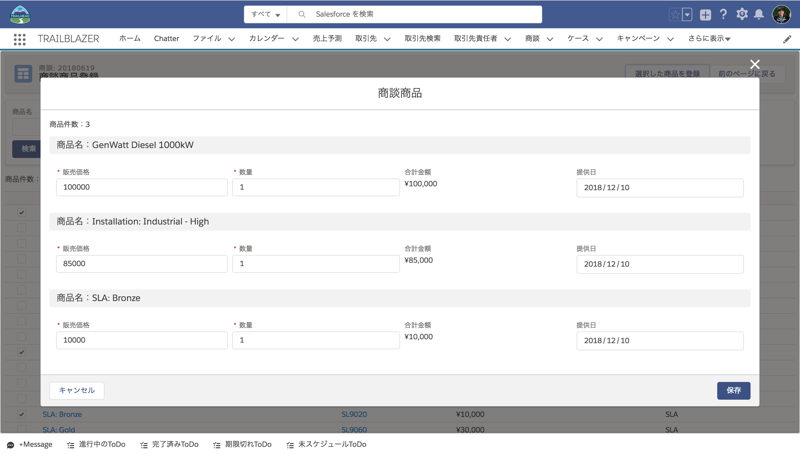

# trailblazer

## Table of Contents
- [Requirements](#requirements)
- [Usage](#usage)
- [Link](#link)
- [Docs](#docs)

## Requirements
- MavensMate

## Usage
### Create Salesforce Project
MavensMateでLocalにSalesforceのプロジェクトを作成。
```
/Users/<user>/project/salesforce/workspace/trailblazer
```

### Setup Git
```
$ cd project/salesforce/workspace/trailblazer
$ git init
$ git remote add origin <path>
$ git fetch origin
$ git reset --hard FETCH_HEAD
```

### write package.xml (src/package.xml)  
```
<?xml version="1.0" encoding="UTF-8"?>
<Package xmlns="http://soap.sforce.com/2006/04/metadata">
    <types>
        <members>AccountSearchController</members>
        <members>AccountSearchControllerTest</members>
        <members>AccountSearchDao</members>
        <members>AccountSearchDaoTest</members>
        <members>AccountSearchHelper</members>
        <members>AccountSearchHelperTest</members>
        <members>AccountSearchWrapper</members>
        <members>AccountSearchWrapperTest</members>
        <members>CommonConst</members>
        <members>CommonConstTest</members>
        <members>CommonDate</members>
        <members>CommonDateTest</members>
        <members>CommonTester</members>
        <members>CommonTesterTest</members>
        <members>CommonUtil</members>
        <members>CommonUtilTest</members>
        <members>OppLineItemRegisterController</members>
        <members>OppLineItemRegisterControllerTest</members>
        <members>OppLineItemRegisterDao</members>
        <members>OppLineItemRegisterDaoTest</members>
        <members>OppLineItemRegisterHelper</members>
        <members>OppLineItemRegisterHelperTest</members>
        <members>OppLineItemRegisterWrapper</members>
        <members>OppLineItemRegisterWrapperTest</members>
        <name>ApexClass</name>
    </types>
    <types>
        <members>AccountSearch</members>
        <members>AccountSearchApp</members>
        <members>AccountSearchAppJs</members>
        <members>AccountSearchControllerJs</members>
        <members>AccountSearchServicesJs</members>
        <members>OppLineItemRegister</members>
        <members>OppLineItemRegisterApp</members>
        <members>OppLineItemRegisterAppJs</members>
        <members>OppLineItemRegisterControllerJs</members>
        <members>OppLineItemRegisterServicesJs</members>
        <name>ApexPage</name>
    </types>
    <types>
        <members>AngularJs</members>
        <members>CommonLexCss</members>
        <name>StaticResource</name>
    </types>
    <version>39.0</version>
</Package>

```

### MavensMate Menu
● Refresh From Server...
- Salesforceから最新のコードを取得できます。
- プロジェクトフォルダを右クリックするとメニューが表示されます。
- 開発作業開始前に実行して差分がない状態にしてください。

### Git Manage Tool
Setup完了後はSourcetreeを使って作業を行います。

## Link
- [MavensMate](https://github.com/joeferraro/MavensMate)
- [Sourcetree](https://ja.atlassian.com/software/sourcetree)

## Docs
### AccountSearch
- 取引先を検索する画面。  
- 取引先検索タブからアクセス。  
  
  


### OppLineItemRegister
- 商談に紐付く商談商品を新規作成するための画面。  
- 商談詳細ページの商談商品作成ボタン(カスタムボタン)からアクセス。  
  
  
  
- 商品検索で表示された商品を選択し登録ボタンをクリックするとポップアップが表示されます。
- ポップアップ内で入力後に保存ボタンをクリックすると商談商品が登録されます。
  
  
